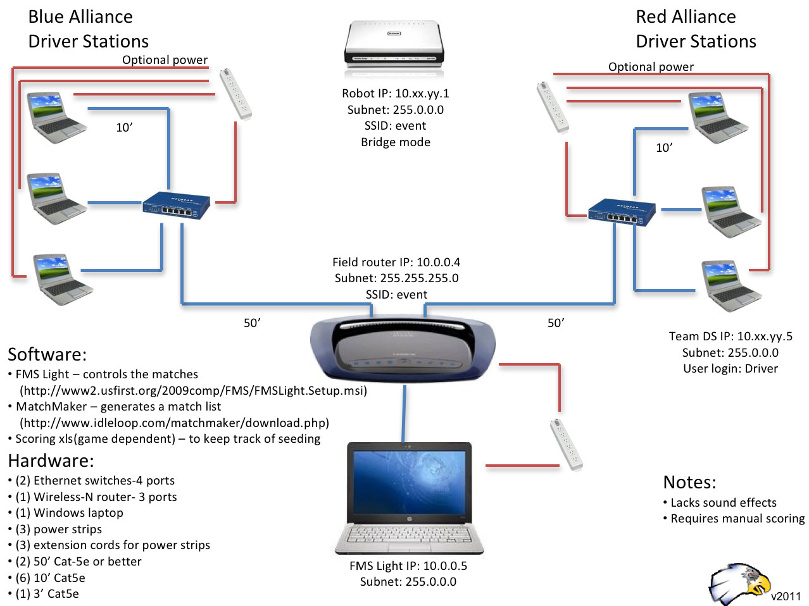

# WPI Library Programming 101

All of the information provided was taken from and can be found [here](https://first.wpi.edu/FRC/roborio/release/docs/java/index.html).

## Field Connections



## Package edu.wpi.first.wpilibj.drive

## Drive Trains

* `DifferentialDrive` - A class for driving differential drive/skid-steer drive platforms such as the Kit of Parts drive base, "tank drive", or West Coast Drive.
* `KilloughDrive` - A class for driving Killough drive platforms.
* `MecanumDrive` - A class for driving Mecanum drive platforms. ([example](https://github.com/NAHSRobotics-Team5667/FRC_2019/blob/master/src/main/java/frc/robot/subsystems/drivetrain/MecanumDriveSubsystem.java))
* `Vector2d` - This is a 2D vector struct that supports basic vector operations.

The WPI Library provides various `drive` classes for the popular drive train mechanism used throughout the FRC Community. Most of these classes require you to pass `SpeedControllers` when instantiating. For example, a Tank Drive would look like this:

```java
Spark m_frontLeft = new Spark(1); // This is a Speed Controller
Spark m_rearLeft = new Spark(2); // This is a Speed Controller
SpeedControllerGroup m_left = new SpeedControllerGroup(m_frontLeft, m_rearLeft); // Speed Controller group to manipulate both Speed Controllers at the same time

Spark m_frontRight = new Spark(3); // This is a Speed Controller
Spark m_rearRight = new Spark(4); // This is a Speed Controller
SpeedControllerGroup m_right = new SpeedControllerGroup(m_frontRight, m_rearRight); // Speed Controller group to manipulate both Speed Controllers at the same time

DifferentialDrive m_drive = new DifferentialDrive(m_left, m_right);
```

The most common methods that you will use in any of these classes will be its respective `drive` method, which may be `ArcadeDrive()`, `driveCartesian()`, or what ever method of driving you decide to use.

Another common method that you will use when dealing with drive trains is the `stopMotor()` method that is inherited from the `RobotDriveBase` class. We always want the Drive Train command to be scheduled immediately, so setting the `DriveTrainCommand` as the default command in the `DriveTrainSubsystem` would be appropriate.

## Package edu.wpi.first.wpilibj

### Motor Controllers (Speed Controllers)

* `DMC60` - Digilent DMC 60 Speed Controller.
* `Jaguar` - Texas Instruments / Vex Robotics Jaguar Speed Controller as a PWM device.
* `PWMTalonSRX` - Cross the Road Electronics (CTRE) Talon SRX Speed Controller with PWM control.
* `PWMVictorSPX` - Cross the Road Electronics (CTRE) Victor SPX Speed Controller with PWM control.
* `SD540` - Mindsensors SD540 Speed Controller.
* `Spark` - REV Robotics SPARK Speed Controller.
* `Talon` - Cross the Road Electronics (CTRE) Talon and Talon SR Speed Controller.
* `Victor` - VEX Robotics Victor 888 Speed Controller The Vex Robotics Victor 884 Speed Controller can also be used with this class but may need to be calibrated per the Victor 884 user manual.
* `VictorSP` - VEX Robotics Victor SP Speed Controller.

The Speed Controller generally depends on the Motor Controller Electrical decides to use that year. Make sure that you are using the right Speed Controller for the right Motor Controller.

### Pneumatics

* `Compressor` - Class for operating a compressor connected to a PCM (Pneumatic Control Module).
* `DoubleSolenoid` - DoubleSolenoid class for running 2 channels of high voltage Digital Output on the PCM.
  * `DoubleSolenoid.Value` Possible values for a DoubleSolenoid.
* `Solenoid` - Solenoid class for running high voltage Digital Output on the PCM.

The `Compressor` class is typically not needed when dealing with pneumatics. The only advantage to having it is if you would like detailed information about the compressor such as the current it is drawing or the pressure switch value. It can also be used to disable and enable the `Compressor`, however, this puts the compressor in an open loop state which is a BIG NO NO in FRC Robotics due to safety and pressure regulations.

When dealing with `DoubleSolenoids` you will typically have similar functionality to that of a normal solenoid. You have an "on" and "off" state, however, these states are defined in the `DoubleSolenoid.Values` Enum.

A single valve solenoid is the simplest solenoid you can have. Similarly to the DoubleSolenoid, you have an "on" state identified as `true` and an "off" state identified as `false`.

### Encoders

* `Encoder` - Class to read quadrature encoders.

When dealing with encoders it is very important that you know what encoder you are dealing with. We should know what the resolution of our encoder is:

* CPR - Counts per Revolution - Found often in Quadature encoders
* PPR - Pulses per Revolution - Found often in Quadature encoders
* LPR - Lines per Revolution - Found often in optical encoders. Not reliable and can be inaccurate!

This year we used the default RedLine Encoders which has a CPR value of 1024 CPR. This means that the encoder will count 1024 times before the shaft makes a full rotation. This assumes of course that the shaft is not geared in any way. This means that we can estimate how many times the shaft has turned based on encoder counts.


### Ultrasonic sensors

* `Ultrasonic` - Ultrasonic rangefinder class.

Typically we want to stray away from using Ultrasonic sensors because of their inaccurate and false readings. They are bad at detecting far away objects as well as detecting close objects. Ultrasonic sensors excel at detecting and measuring objects from a medium distance, which is incredibly limiting for FRC. Because the Ultrasonic sensor can be inaccurate, you should never make autonomous functionality completely dependent on an Ultrasonic sensor without proper testing first!

### Limit Switches

* `DigitalInput` - Class to read a digital input.

## Network Tables

### Package edu.wpi.first.networktables

* `NetworkTable` A network table that knows its subtable path.
* `NetworkTableEntry` - NetworkTables Entry.
* `NetworkTableInstance` - NetworkTables Instance.

## Shuffleboard and SmartDashboard

### Package edu.wpi.first.wpilibj.shuffleboard

* `Shuffleboard` - The Shuffleboard class provides a mechanism with which data can be added and laid out in the Shuffleboard dashboard application from a robot program.

### Package edu.wpi.first.wpilibj.smartdashboard

* `SmartDashboard` - The SmartDashboard class is the bridge between robot programs and the SmartDashboard on the laptop.
