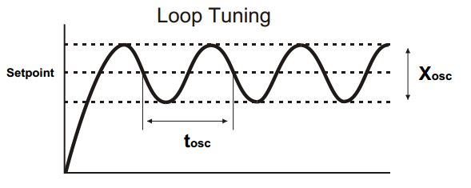
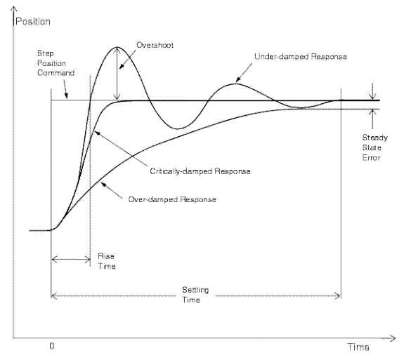
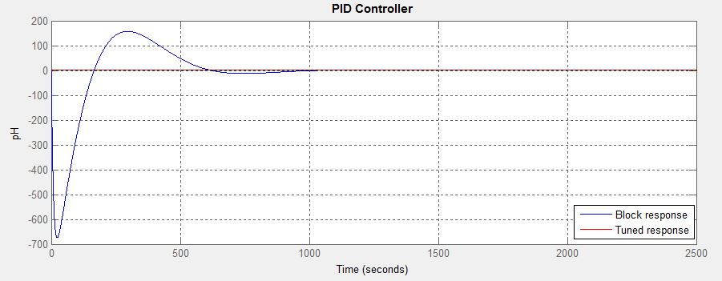

# PID Basics

In order to understand PID Controllers we must understand what "Open" and "Closed" control loops are -

* Open Control Loop - Runs freely without any sort of feed back (non-feedback system) and acts solely on input. An example of an open loop would be a light switch. When switched on - the light bulb is receiving constant voltage regardless of anything. When off the opposite is true.
* Closed Control Loop - Runs on a feedback system. An example of a Closed Control Loop would be your A/C when set to auto. Your A/C turns on when it gets too hot and turns off when it gets too cold. The feedback here being the current temperature.

With that, PID Controllers are a form of closed loop controllers. They require some sort of feedback in order to operate. A PID Controller has 3 main parts to it - A proportional, integral, and derivative. By using all 3 of these mathematical components, we can properly create a smooth form of mechanism behavior. Let's use an elevator for this example. When you ride an elevator it always starts off slow and speeds up half way into the ride. At approximately 3/4ths of the ride the elevator beings to slow down so that it reaches its target floor not only smoothly but also accurately. That is essentially what PID does. It allows our mechanisms to not only behave smoothly, but also accurately.

With PID we always have gain constants for each factor denoted like so: `kP, kI, kD`. These constants will help us calculate the ultimate output that we would like to provide.

The final PID formula looks something like this -

`output = (kP × error) + (kI × ∑error) + (kD × δerror / δt)`

Now if none of that makes sense to you that's ok. Let's start by breaking it up -

## Proportional

The proportional value is calculated using `kP * error`. If we calculated our output using only this calculation, that would be known as a "P Controller". We are only implementing the Proportional portion of the formula. Typically, in FRC you only need the proportional calculation to get the desired result you want; however, this will require some proper tuning of the `kP` value. Having only a P controller, however, can produce bad behavior. Take a look at this graph -



Looking at this image we can see that the mechanism is stuck in a never ending oscillating state. This is terrible because that means that the mechanism will never reach its target. In order to fix this issue we can either continue tuning the `kP` gain and hope that we reduce the oscillation, or we can introduce the D part of a PID Controller.

## Integral

Ideally when it comes to FRC, we want to stray away from I when we are creating our PID Controllers. The reason for this is because how inaccurate they actually make the mechanism after some time; however, we will discuss that in the next couple of paragraphs. By introducing the I to the controller we now have what is called a PI Controller. The integral is total error multiplied by the `kI` gain. Mathematically, it looks like this:

`(kI × ∑ error)`

However, programmatically it looks like this:

```java
public void calculateI(){
    double error = target - actual;
    total_error += error;

    double I = kI * total_error;
}
```

Makes more sense like that in my opinion - Can you see why having an I can be a bad thing? The fact that the I portion is calculated using the total error over time means that the total error will continuously get bigger over time. This means that the I portion of the PID Output will get bigger over time making the output larger and larger as time increases. There are ways to combat this such as resetting the total error after a certain point or capping it at a certain value, but having an I overall makes tuning your PID Controller and getting consistent results a - bleep -. That is why we should stray away from using the I part of a PID Controller unless we absolutely have to. Instead, we should try to implement the D portion of the controller first.

## Derivative

A PD Controller typically solves the oscillation problem that comes with just a P Controller if properly tuned. It can also solve any steady state errors, which practically provides the output with the final nudge needed to reach the target. If you've taken calculus you know that the derivative is basically a way to show the rate of change. Mathematically, the D portion of the controller looks like this:

`(kD × δerror / δt)`

Programmatically, the D portion looks like this:

```java
public void calculateD(){
    double error = target - actual;
    double d_error = error - last_error;

    double D = kD * d_error;
}
```

Notice that programmatically we do not need to divide by delta time. If you would like really precise values, you may want to find some way to calculate the delta time.

A majority of PID Subsystems will function just fine with just a PD Controller, however, there is one last improvement we can make: implementing a feed forward portion if necessary.

## Feed Forward

When using PID Controllers we typically want a Feed Forward value implemented to combat any guaranteed/predicted "friction". For example, for an elevator, the mechanism will consistently receive some sort of force applied by gravity. We would implement a feed forward value that counter-acts gravity here in order to combat this and get smoother results. For example, a robot elevator trying to get to a certain level will apply a certain amount of power to get to a certain position based on error. Now lets say that the elevator is traveling the same error downwards. This time, the elevator has gravity working with it meaning that the elevator will be faster, thus potentially making it harder to reach the target. A feed forward value not only gets rid of the force of gravity when traveling up, but also down. That is the ultimate goal you want your feed forward value to combat. Our equation now looks like this:

`output = feedforward + (kP × error) + (kI × ∑error) + (kD × δerror / δt)`

## Implementing PID Controllers into Subsystems

When implementing a PID Controller you can either implement it into the Subsystem's command or the Subsystem itself. It truthfully doesn't matter as long as the PID Controller is called appropriately. With the WPI Library, they provide a `PIDSubsystem` class; however, the class is going to be changed in the near future, which could cause certain code to potentially break. You can, however, by creating your own PID Controller class. The WPI Library PIDSubsystem class also isn't liked very much in the community and teams often prefer to create their own basic PID Controller class.

## PID Gain Tuning

Take a look at this graph:



By looking at this graph we can see 3 states that our PID Controller can be in. An overdamped state, underdamped state, or critically damped state.

* Overdamped - The gains are too strong causing the PID curve too long to reach the target. This means that we are apply output for longer periods of time and overall just slow.
* Underdamped - The gains are too low causing the PID curve to overshoot the target and potentially oscillate.
* Critically damped - The gains cause the PID curve to take longer than desired to reach the target but ultimately has low to no oscillations.

A critically damped PID loop might not be such a bad thing if you don't mind the time it takes to reach the target, however, when it comes to cycle times and speed you always want a properly tuned PID loop. The simplest but most effective way to tune a PID Controller is:

1. Set all gains to zero.
2. Increase kP until you see steady oscillation.
3. Increase kD until the oscillations go away (critically damped)
4. Repeat steps 2 and 3 until increasing kD does not stop the oscillations.
5. Set kP and kD to the last stable values.
6. Increase the kI gain until it brings you to the setpoint with the number of oscillations desired (normally zero but a quicker response can be had if you don't mind a couple oscillations of overshoot)

[source](https://robotics.stackexchange.com/questions/167/what-are-good-strategies-for-tuning-pid-loops)

A properly tuned PID loop should look something like this:



We should have immediate response to the target, a slight overshoot due to the immediate response and momentum, and then an adjustment to fix that overshoot. This PID loop is fast, accurate, and efficient and ideally what we should aim for.
